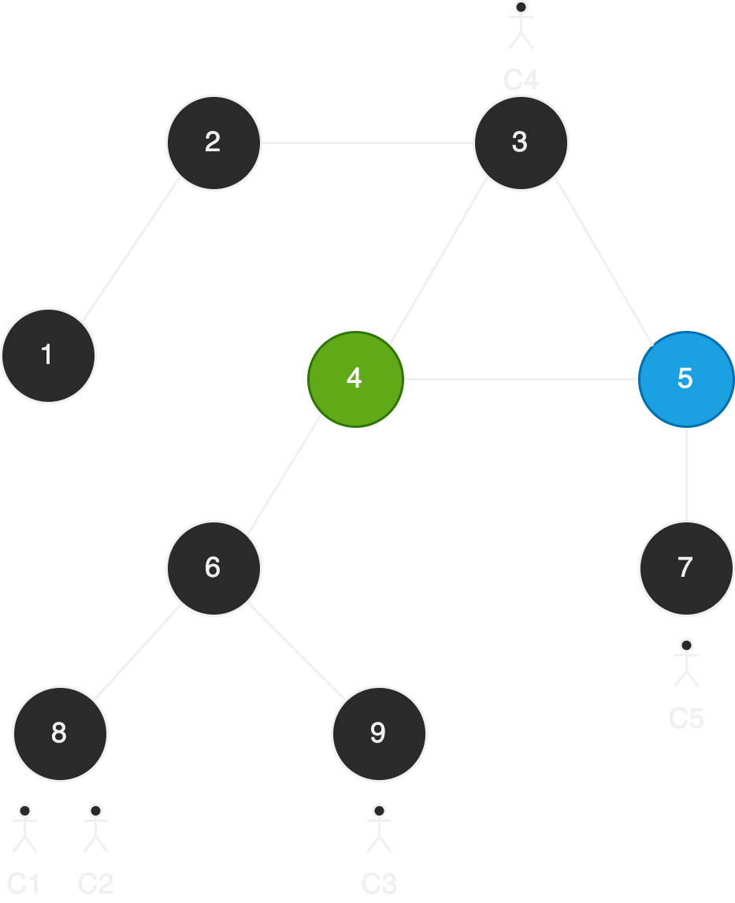

### Scheduler interface

- When a client connects to a node with a new set of applications to use.
  - Node + {Applications} (?incremental)
- When a new application is setup on a set of nodes.
  - {Nodes} + Application
- Topology changes

Scheduler outputs a placement that satisfies the following

- single node constraints
  - Node compute and memory requirements
- All pairwise node constraints
  - Inter node bw requirements

## Notation

### Application Requirement Notation

An application is
- A set of components.
- A graph of nodes that are communicating with each other
- Every node in graph has independent set of HW requirements.

| Symbol      | Description |
| ----------- | ----------- |
| $A$         | Set of applications. |
| $A_k$       | Application $k$. |
| $\|A_k\|$   | Number of components in Application $k$. |
| $p_{ki}$    | Compute required for component $i$ of application $k$. |
| $m_{ki}$    | Memory required for component $i$ of application $k$. |
| $s_{ki}$    | Container size for component $i$ of application $k$. |
| $b_{kij}$   | BW required between component $i$ and component $j$ of application $k$. |
| $\hat{b}_{ki}$    | BW required for a client to communicate with component $i$ of application $k$.  |
| $l_{kij}$   | Latency required between component $i$ and component $j$ of application $k$. |
| $\hat{l}_{ki}$    | Latency required for a client to communicate with component $i$ of application $k$.  |

### Topology Notation

| Symbol      | Description |
| ----------- | ----------- |
| $T$         | Topology |
| $\|T\|$     | Number of nodes in the topology. |
| $T^{a}$     | Node $a$ of the topology |
| $P^{a}$     | Compute present on node $a$ |
| $M^{a}$     | Memory present on node $a$  |
| $B^{ab}$    | Avg BW between node $a$ and $b$ |
| $L^{ab}$    | Avg latency between node $a$ and $b$ |

### Client Notation

| Symbol      | Description |
| ----------- | ----------- |
| $C$         | Clients in the system |
| $C_l$       | Client $l$ |
| $C^{a}_{lk}$| equals 1 iff client $l$ connects to application $k$ at node $a$ | 

### Assignment Notation

| Symbol           | Description |
| -------------    | ----------- |
| $X^{a}_{kj}(t)$  | equals 1 iff at time $t$, service $j$ of application $k$ is allocated on node $a$ |
| $Y_k(t)$         | equals 1 iff at time $t$, all services of application $k$ are allocated. |
| $E^{ab}_{ki}(t)$ | equals 1 iff from time $t-1$ to $t$, the service $i$ of application $k$ was moved from node $a$ to node $b$. |

$$Y_k(t) = [ N_k ==  \sum_{a,j}{} X^{a}_{kj}(t) ]$$

$$ E^{ab}_{ki}(t) = [X^{a}_{ki}(t-1) - X^{a}_{ki}(t)]X^{b}_{ki}(t) $$

### Example

Time = 1

$$ X^{4}_{1,1}(1) = X^{5}_{1,2}(1) = 1 $$
$$ Y_k(1) = 2 $$

$$ C^{8}_{1,1} = C^{8}_{2,1} = C^{9}_{3,1} = C^{3}_{4,1} = C^{7}_{5,1} = 1 $$

Time = 2

$$ E^{5,6}_{1,2}(2) = 1 $$

## Modelling

We are going to do three seperate schedulings.
1. Application time scheduling
2. Client time scheduling
3. Topology scheduling (includes latency measurements)

### Constraints

The following constraints restrict the total HW resources

$$ P^a \geq \sum_{k,i} p_{ki}X^a_{ki} $$
$$ M^a \geq \sum_{k,i} m_{ki}X^a_{ki} $$
$$B^{ab} \geq \sum_{k,i,j} b_{kij}X^a_{ki}X^b_{kj} + \sum_{l,k,i} \hat{b}_{ki} X^a_{ki} C^b_{lk}  $$
$$ L^{ab} \leq l_{kij} X^a_{ki} X^b_{kj}  $$
$$ L^{ab} \leq \hat{l}_{ki} C^{a}_{lk} X^b_{ki} $$

### Objective function

For bootstrap scheduling we just try to maximize the number of applications deployed. So the objective function is simply

$$maximize \ \sum_k Y_k(t)$$

For active scheduling, we try to minimize the transfer time to move nodes from an initial placement $X(t-1)$ to $X(t)$. The objective function in this case would be

$$ minimize \   ( maximum_{a,b,k}  \ \sum_{i} \frac{1}{B^{ab}}  E^{ab}_{ki}(t) s_{ki} ) $$
